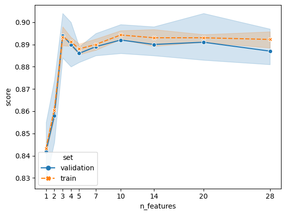

[](https://github.com/ClaudioSalvatoreArcidiacono/felimination/actions?query=workflow%3A%22Tests%22)
[](#)
[](https://claudiosalvatorearcidiacono.github.io/felimination/)


# felimination

This library contains some useful scikit-learn compatible classes for feature selection.

## Features

- [Recursive Feature Elimination with Cross Validation using Permutation Importance](reference/RFE.md#felimination.rfe.PermutationImportanceRFECV)

## Requirements

- Python 3.7+
- NumPy
- Scikit-learn
- Pandas

## Installation

In a terminal shell run the following command
```
pip install felimination
```

## Usage

```python
from felimination.rfe import PermutationImportanceRFECV
from sklearn.linear_model import LogisticRegression
from sklearn.datasets import make_classification
import numpy as np


X, y = make_classification(
    n_samples=1000,
    n_features=20,
    n_informative=6,
    n_redundant=10,
    n_clusters_per_class=1,
    random_state=42,
)

selector = PermutationImportanceRFECV(LogisticRegression(), step=0.3)

selector.fit(X, y)

selector.support_
# array([False, False, False, False, False, False, False, False, False,
#        False, False,  True, False, False, False, False, False, False,
#        False, False])

selector.ranking_
# array([9, 3, 8, 9, 7, 8, 5, 6, 9, 6, 8, 1, 9, 7, 8, 9, 9, 2, 4, 7])
selector.plot()
```


It looks like `5` is a good number of features, we can set the number of features to select to 5 without need of retraining

```python
selector.set_n_features_to_select(5)
selector.support_
# array([False,  True, False, False, False, False,  True, False, False,
#        False, False,  True, False, False, False, False, False,  True,
#         True, False])
```

## License

This project is licensed under the BSD 3-Clause License - see the LICENSE.md file for details

## Acknowledgments

- [scikit-learn](https://scikit-learn.org/)
