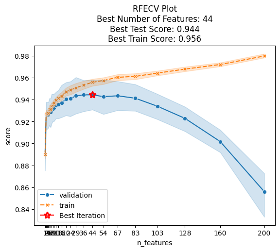

[](https://github.com/ClaudioSalvatoreArcidiacono/felimination/actions?query=workflow%3A%22Tests%22)
 [](#)
 [](https://claudiosalvatorearcidiacono.github.io/felimination/)

# Felimination

This library contains some useful scikit-learn compatible classes for feature selection.

## Features

- [Recursive Feature Elimination with Cross Validation using Permutation Importance](https://claudiosalvatorearcidiacono.github.io/felimination/reference/RFE/#felimination.rfe.PermutationImportanceRFECV)
- [Hybrid Genetic Algorithms x Feature Importance selection](https://claudiosalvatorearcidiacono.github.io/felimination/reference/genetic_algorithms/#felimination.ga.HybridImportanceGACVFeatureSelector)


## Requirements

- Python 3.10+
- NumPy
- Scikit-learn
- Pandas

## Installation

In a terminal shell run the following command
```
pip install felimination
```

## Usage

### Recursive Feature Elimination
In this section it will be illustrated how to use the `PermutationImportanceRFECV` class.

```python
import numpy as np
from sklearn.datasets import make_classification
from sklearn.linear_model import LogisticRegression

from felimination.rfe import PermutationImportanceRFECV


X, y = make_classification(
    n_samples=1000,
    n_features=20,
    n_informative=6,
    n_redundant=10,
    n_clusters_per_class=1,
    random_state=42,
)

selector = PermutationImportanceRFECV(LogisticRegression(), step=0.3)

selector.fit(X, y)

selector.support_
# array([False, False, False, False, False, False, False, False, False,
#        False, False,  True, False, False, False, False, False, False,
#        False, False])

selector.ranking_
# array([9, 3, 8, 9, 7, 8, 5, 6, 9, 6, 8, 1, 9, 7, 8, 9, 9, 2, 4, 7])
selector.plot()
```


It looks like `5` is a good number of features, we can set the number of features to select to 5 without need of retraining

```python
selector.set_n_features_to_select(5)
selector.support_
# array([False,  True, False, False, False, False,  True, False, False,
#        False, False,  True, False, False, False, False, False,  True,
#         True, False])
```

## Genetic Algorithms
In this section it will be illustrated how to use the `HybridImportanceGACVFeatureSelector` class.

```python
import numpy as np
from sklearn.datasets import make_classification
from sklearn.linear_model import LogisticRegression

from felimination.ga import HybridImportanceGACVFeatureSelector


# Create dummy dataset
X, y = make_classification(
    n_samples=1000,
    n_features=20,
    n_informative=6,
    n_redundant=10,
    n_clusters_per_class=1,
    random_state=42,
)

# Initialize selector
selector = HybridImportanceGACVFeatureSelector(
    LogisticRegression(random_state=42),
    random_state=42,
    pool_size=5,
    patience=5
)

# Run optimisation
selector.fit(X, y)

# Show selected features
selector.support_
#array([False,  True, False,  True,  True, False, False, False,  True,
#       False, False, False,  True,  True,  True,  True, False,  True,
#        True, False])

# Show best solution
selector.best_solution_
# {'features': [1, 12, 13, 8, 17, 15, 18, 4, 3, 14],
#  'train_scores_per_fold': [0.88625, 0.89, 0.8825, 0.8925, 0.88625],
#  'test_scores_per_fold': [0.895, 0.885, 0.885, 0.89, 0.89],
#  'cv_importances': [array([[ 1.09135972,  1.13502636,  1.12100231,  0.38285736,  0.28944072,
#            0.04688614,  0.44259813,  0.09832365,  0.10190421, -0.48101593]]),
#   array([[ 1.17345812,  1.29375208,  1.2065342 ,  0.40418709,  0.41839714,
#            0.00447802,  0.466717  ,  0.21733829, -0.00842075, -0.50078996]]),
#   array([[ 1.15416104,  1.18458564,  1.18083266,  0.37071253,  0.22842685,
#            0.1087814 ,  0.44446793,  0.12740545,  0.00621562, -0.54064287]]),
#   array([[ 1.26011643,  1.36996058,  1.30481424,  0.48183549,  0.40589887,
#           -0.01849671,  0.45606913,  0.18330816,  0.03667055, -0.50869557]]),
#   array([[ 1.18227123,  1.28988253,  1.2496398 ,  0.50754295,  0.38942303,
#           -0.01725074,  0.4481891 ,  0.19472963,  0.10034316, -0.50131192]])],
#  'mean_train_score': 0.8875,
#  'mean_test_score': 0.889,
#  'mean_cv_importances': array([ 1.17227331,  1.25464144,  1.21256464,  0.42942709,  0.34631732,
#          0.02487962,  0.45160826,  0.16422104,  0.04734256, -0.50649125])}

# Show progress as a plot
selector.plot()
```


Looks like that the optimisation process converged after 2 steps, since the best score did not improve for 5(=`patience`) consecutive steps, the optimisation process stopped early.

## License

This project is licensed under the BSD 3-Clause License - see the LICENSE.md file for details

## Acknowledgments

- [scikit-learn](https://scikit-learn.org/)
